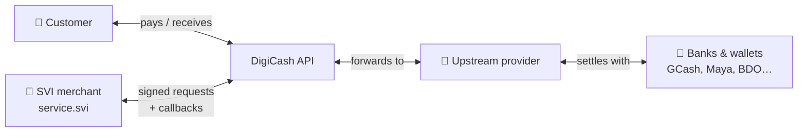
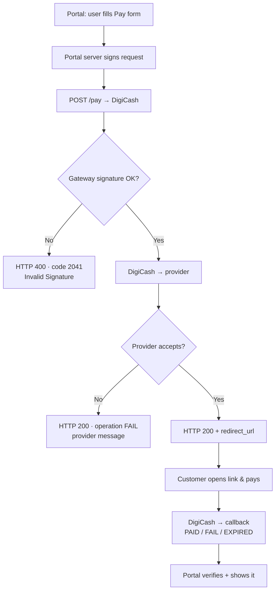
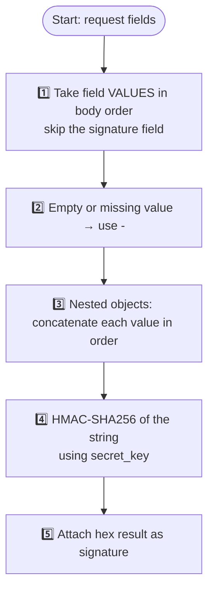
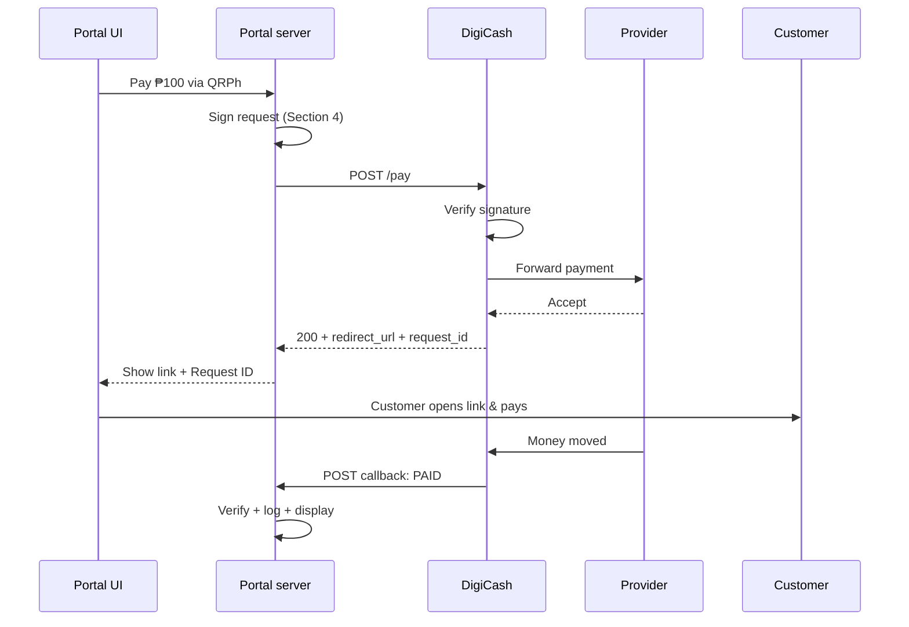
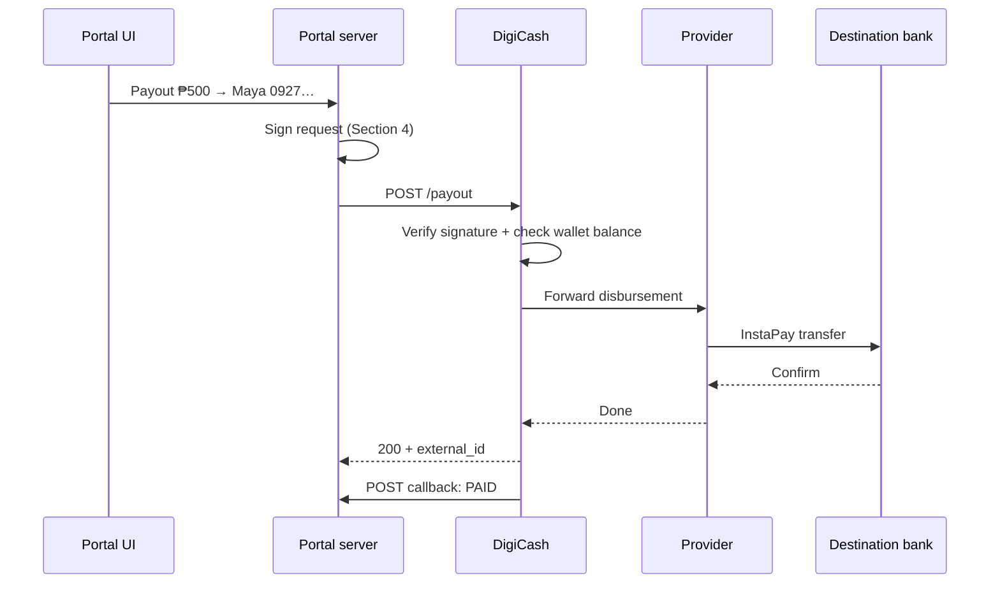
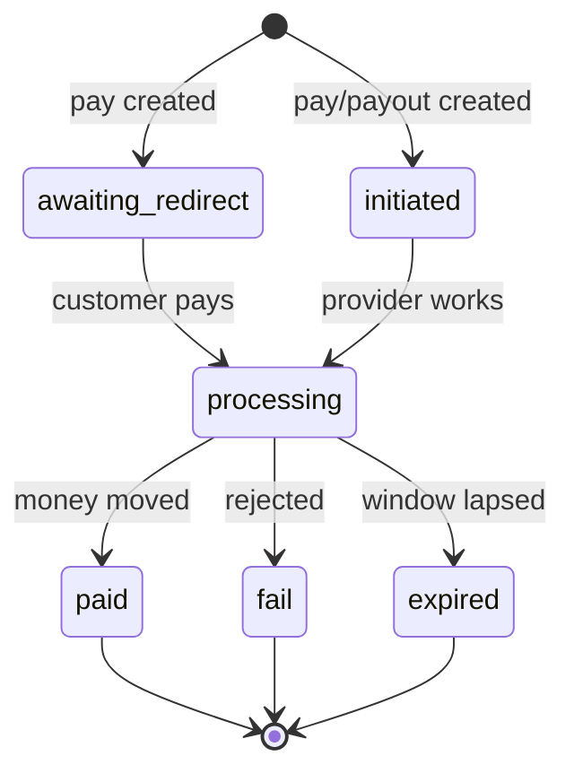
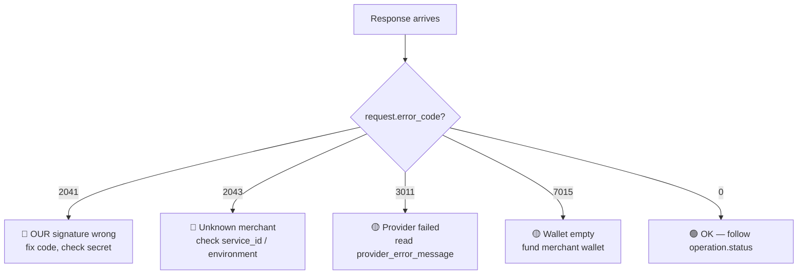
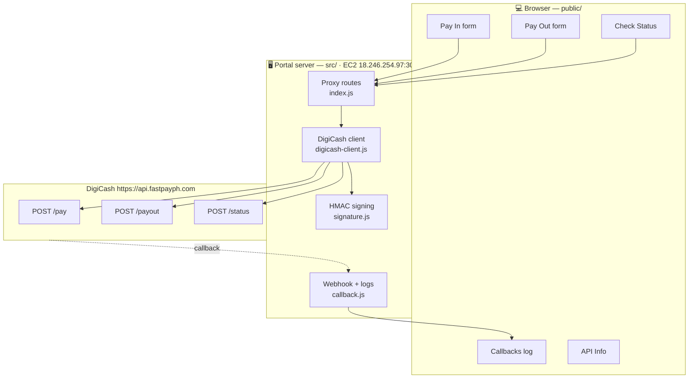

# DigiCash API — Technical Documentation

**SVI DigiCash POC · Ticket CPS-471 · For stakeholder presentation**

> Plain-English guide to the DigiCash / IOT ACH Payment API: what it does, how money moves,
> how authentication works, and how our POC uses it — with verified test evidence.
>
> Official reference: [Postman documentation](https://documenter.getpostman.com/view/40991288/2sB3dLTB3U)

---

## Table of contents

1. [What is DigiCash?](#1-what-is-digicash)
2. [Environments](#2-environments)
3. [The four APIs at a glance](#3-the-four-apis-at-a-glance)
4. [Authentication & signatures](#4-authentication--signatures)
5. [Pay API — collect money](#5-pay-api--collect-money)
6. [Payout API — send money](#6-payout-api--send-money)
7. [Status API — check a transaction](#7-status-api--check-a-transaction)
8. [Callback API — real-time notifications](#8-callback-api--real-time-notifications)
9. [Transaction statuses](#9-transaction-statuses)
10. [Amounts: major vs minor units](#10-amounts-major-vs-minor-units)
11. [Errors we have seen](#11-errors-we-have-seen)
12. [How our POC fits together](#12-how-our-poc-fits-together)
13. [Test evidence](#13-test-evidence)
14. [Open items & next steps](#14-open-items--next-steps)
15. [Glossary](#15-glossary)
16. [DigiCash FAQ — official answers](#16-digicash-faq--official-answers)

---

## 1. What is DigiCash?

DigiCash (IOT ACH) is a Philippine payment gateway. Think of it as a **middleman** with two jobs:

- **Pay in** — collect money from customers via e-wallets and QR codes, then settle it to us.
- **Pay out** — send money from our DigiCash wallet to any bank or e-wallet via InstaPay.

Four parties are involved in every transaction:



| Party | Role |
|---|---|
| **Customer** | Pays through GCash / QR, or receives a payout |
| **SVI (merchant `service.svi`)** | Our side — sends signed requests, receives callbacks |
| **DigiCash** | Gateway — validates us, routes to the provider |
| **Upstream provider** | Moves the money with banks and wallets (DigiCash's samples name Starpay — TBC for production) |

---

## 2. Environments

| Environment | Base URL | Used for |
|---|---|---|
| **Production** | `https://api.fastpayph.com` | Live testing now (per DigiCash instruction) |
| UAT | `https://uat-api.fastpayph.com` | Sandbox (our `service.svi` is not registered there) |

All calls are `POST` with `Content-Type: application/json`.

---

## 3. The four APIs at a glance

| API | Endpoint | Purpose | Who calls whom |
|---|---|---|---|
| **Pay** | `POST /pay` | Start a customer payment | Us → DigiCash |
| **Payout** | `POST /payout` | Send money to a bank/wallet | Us → DigiCash |
| **Status** | `POST /status` | Ask "what happened to transaction X?" | Us → DigiCash |
| **Callback** | `POST {our callback_url}` | DigiCash pushes result updates to us | DigiCash → Us |

**Pay vs payout — don't mix them up:**

| | Pay (money in) | Payout (money out) |
|---|---|---|
| Direction | Customer → us | Us → customer |
| Who acts | Customer pays on a DigiCash page | We push to their bank / wallet |
| Methods | GCash, PalawanPay, QRPh, QRPh VIP | InstaPay (92 banks & wallets) |
| Money comes from | Customer's wallet | Our prefunded DigiCash wallet |
| Typical use | Checkout, top-up, collection | Disbursement, salary, refund |



---

## 4. Authentication & signatures

Every request carries three credentials plus a signature. The passwork and secret key are never exposed in the browser — signing happens on our server.

| Credential | Example | Meaning |
|---|---|---|
| `service_id` | `service.svi` | Our merchant account name |
| `passwork` | `••••••••••••` | Our merchant password (server-side only) |
| `secret_key` | `••••••••••••••••••••••••••••••` (30 chars) | Private signing key — server-side only, never committed |

**How a signature is made** (verified byte-for-byte against DigiCash's official Postman scripts):



Example — a ₱1.00 GCash payment signs this exact string:

```
service.svi + [passwork] + 100 + PHP + <operation_id> + <payment_id>
+ gcash + <callback_url> + <return_url>
```

Field order per endpoint (must match exactly — the probe in [Section 13](#13-test-evidence) proved it):

| Endpoint | Signing order |
|---|---|
| Pay | `service_id, passwork, amount, currency, operation_id, payment_id, by_method, callback_url, return_url` |
| Payout | same as Pay, then `customer{account_bank_id, account_number, account_name, email, phone_number}` |
| Status | `passwork, service_id, request_id` (note: passwork first) |

Responses and callbacks carry signatures the same way, so we can verify nothing was tampered with.

---

## 5. Pay API — collect money

**`POST {base}/pay`**

| Field | Required | Meaning |
|---|---|---|
| `service_id` / `passwork` | Yes | Our credentials |
| `amount` | Yes | Amount in **minor units** as a string (see [Section 10](#10-amounts-major-vs-minor-units)) |
| `currency` | Yes | `PHP` |
| `operation_id` | Yes | Our unique ID for the transaction |
| `payment_id` | Yes | A second unique ID (may equal operation_id) |
| `by_method` | Yes | `gcash`, `palawanpay`, `qrph`, or `qrph-vip` |
| `callback_url` | Yes | Where DigiCash sends result updates |
| `return_url` | Yes | Where the customer lands after paying |
| `signature` | Yes | HMAC per [Section 4](#4-authentication--signatures) |

**Payment methods:**

| Code | Human name | What it is | Status |
|---|---|---|---|
| `gcash` | GCash | E-wallet payment | ❌ Discontinued by DigiCash |
| `palawanpay` | PalawanPay | Palawan pawnshop wallet | ❌ Discontinued by DigiCash |
| `qrph` | QRPh Standard | National QR-code payment (up to ₱300–500k) | ✅ Use this |
| `qrph-vip` | QRPh VIP | QRPh with higher limits | ✅ Use this |

**Success response** — hand `redirect_url` to the customer:

```json
{
  "request_id": "01JX4PFRAY0NEM43EJ9NVQVFZ2",
  "operation_id": "PAY…",
  "redirect_url": "https://checkout… (customer pays here)",
  "operation": { "status": "initiated", "error_code": 0, "error_message": "" },
  "request": { "status": "success", "error_code": 0, "error_message": "" },
  "timestamp": "2026-09-07 14:26:44",
  "signature": "…"
}
```



---

## 6. Payout API — send money

**`POST {base}/payout`** — disburses from our **prefunded DigiCash wallet** to any InstaPay destination.

Same fields as Pay, plus `by_method: "instapay"` and a `customer` object:

| Customer field | Required | Meaning |
|---|---|---|
| `account_bank_id` | Yes | Destination code, e.g. `PAPH` (Maya), `GXCH` (GCash), `BNOR` (BDO) |
| `account_number` | Yes | Account / wallet number |
| `account_name` | Yes | Account holder name |
| `email` | Yes | Customer email |
| `phone_number` | Yes | `09xxxxxxxxx` or `+63xxxxxxxxxx` |
| `address`, `remark` | Optional | Only sent when provided |

**Supported destinations (92 total). Most-used:**

| Code | Name | Code | Name |
|---|---|---|---|
| `GXCH` | GCash | `PAPH` | Maya |
| `BNOR` | BDO Unibank | `BOPI` | BPI |
| `MBTC` | Metrobank | `PNBM` | Philippine National Bank |
| `TLBP` | LANDBANK | `SETC` | Security Bank |
| `UBPH` | UnionBank | `RCBC` | RCBC / DiskarTech |
| `CHBK` | China Bank | `GOTY` | GoTyme Bank |
| `TDBI` | Tonik Bank | `CIPH` | CIMB Bank |
| `SHPH` | ShopeePay | `GHPE` | GrabPay |
| `DCPH` | Coins.ph | `PPSF` | PalawanPay |

(Full searchable list lives in the portal's **API Info** tab.)



> ⚠️ Payouts draw from our DigiCash wallet balance. An empty wallet returns code `7015 Insufficient Funds` — this is what we hit in testing ([Section 13](#13-test-evidence)).

---

## 7. Status API — check a transaction

**`POST {base}/status`** — reconciliation and "what happened?" checks. Works anytime, no inbound access needed.

| Field | Meaning |
|---|---|
| `passwork`, `service_id` | Our credentials (passwork first — [Section 4](#4-authentication--signatures)) |
| `request_id` | DigiCash's ID from the Pay/Payout response (sent when available) |
| `operation_id` | **Required by the live API** — omitting it returns `5020 operation_id is required`, even with a valid `request_id`. The docs only mention `request_id`; live behavior differs. Our client sends both when available. |
| `signature` | HMAC per [Section 4](#4-authentication--signatures) |

Response echoes **both** IDs so we can match it to our records:

```json
{
  "request_id": "01JX… (DigiCash's ID)",
  "operation_id": "PAY… (our ID)",
  "operation": { "status": "paid", … },
  "request": { "status": "success", … },
  "timestamp": "…",
  "signature": "…"
}
```

---

## 8. Callback API — real-time notifications

DigiCash `POST`s to our `callback_url` whenever a transaction changes state. Our endpoint must be public, answer within seconds, and always reply `200 OK` (even for bad signatures — log and ignore those).

```json
{
  "external_id": "4186442302422325",
  "provider_id": "STARPAY_PAY",
  "provider_name": "STARPAY",
  "operation_id": "PAY… (our ID)",
  "payment_method": "qrph",
  "amount": "100",
  "currency": "PHP",
  "operation": { "status": "PAID", "error_code": null, "error_message": null },
  "customer": { "account_number": "0917…", "name": "…", "email": "…" },
  "signature": "…"
}
```

Only four statuses ever arrive: `PROCESSING`, `PAID`, `FAIL`, `EXPIRED`. (Provider fields quote DigiCash's samples, which name Starpay — production provider TBC.)

> ⚠️ Callbacks cannot reach us yet — our EC2 port 3000 is firewalled. Polling `/status` covers the gap until the port (or a tunnel) is opened. See [Section 14](#14-open-items--next-steps).

---

## 9. Transaction statuses



| Status | Where seen | Meaning |
|---|---|---|
| `awaiting_redirect` | Pay response | Waiting for the customer to open the payment page |
| `initiated` | Pay/Payout response | Transaction created, waiting |
| `processing` / `PROCESSING` | Response / callback | Being processed |
| `paid` / `PAID` | Response / callback | ✅ Money moved — final |
| `fail` / `FAIL` | Response / callback | ❌ Rejected — final, read the provider message |
| `expired` / `EXPIRED` | Response / callback | ⏰ Payment window lapsed — final |

---

## 10. Amounts: major vs minor units

Amounts are strings in **minor units (centavos)** — no decimals, no commas:

| You mean | You send |
|---|---|
| ₱1.00 | `"100"` |
| ₱100.00 | `"10000"` |
| ₱250.50 | `"25050"` |

The portal converts automatically (type `100` → sends `"10000"`).

---

## 11. Errors we have seen

| Code | HTTP | Where | Meaning | Owner | Status |
|---|---|---|---|---|---|
| `0` | 200 | request | Success | — | ✅ Working |
| `2041` | 400 | gateway | **Our** signature rejected — the gateway HMAC check failed | Ours | ✅ Fixed — 7-variant live probe (2026-09-07) proved only the Postman field order passes; all other orders are correctly rejected |
| `2043` | 400 | gateway | Service ID unknown in that environment (seen on UAT, where we were never registered) | Ours | ✅ Resolved — production accepts `service.svi` since the move to `api.fastpayph.com` |
| `3011` | 200 | provider wrapper | Downstream failure — read `provider_error_message` | DigiCash | 🔴 Open (awaiting their fix) |
| `7015` | 400 | business rule | Merchant wallet empty — fund it, then retry | DigiCash | 🔴 Open (awaiting funding) |
| `provider: "Invalid signature"` | 200 | Upstream provider | DigiCash↔provider signing misconfigured — DigiCash must fix ([Section 13](#13-test-evidence)) | DigiCash | 🔴 Open (awaiting their fix) |

Two layers, two messages — don't confuse them:



---

## 12. How our POC fits together



| POC piece | Covers |
|---|---|
| `src/utils/signature.js` | [Section 4](#4-authentication--signatures) signing + verification (proven vs gateway, [Section 13](#13-test-evidence)) |
| `src/api/digicash-client.js` | [Section 5](#5-pay-api--collect-money) Pay, [Section 6](#6-payout-api--send-money) Payout, [Section 7](#7-status-api--check-a-transaction) Status |
| `src/routes/callback.js` | [Section 8](#8-callback-api--real-time-notifications) webhook, log viewer, `/api/config` diagnostics |
| `src/index.js` | Server + browser-safe proxies (secret never leaves the server) |
| `public/` portal | Pay In · Pay Out · Check Status · Callbacks · API Info tabs |
| `tests/probe-signature-order.js` | Live 7-variant signature proof |
| `Dockerfile` + `docker-compose.yml` + `deploy.sh` | One-command EC2 deploy |

---

## 13. Test evidence

Environment: production `https://api.fastpayph.com` · merchant `service.svi` · whitelisted IP `18.246.254.97` · credentials verified byte-exact (lengths 11/12/30, no whitespace).

| # | Test | Result |
|---|---|---|
| 1 | Signature probe, 7 field orders | ✅ Postman order passes gateway (HTTP 200 + `trans_id`); all others → gateway `2041`. **Our signing is spec-compliant.** |
| 2 | Pay via GCash | ✅ Gateway accepts → ❌ provider `Invalid signature` (DigiCash-side, `trans_id` 6136839 / 6136922) |
| 3 | Pay via QRPh | ✅ Gateway accepts → ❌ same provider error (`trans_id` 6137002) — method-independent |
| 4 | Payout via InstaPay | ✅ Gateway accepts → `7015 Insufficient Funds` (wallet empty — needs funding, then retest) |
| 5 | Callbacks | ✅ Simulated PAID/FAIL/EXPIRED/PROCESSING all received, validated, displayed. Real ones blocked by firewall ([Section 14](#14-open-items--next-steps)) |
| 6 | Status API | ⏳ Awaiting one successful transaction to query |
| 7 | Portal UI | ✅ 3-column layout, error display, API Info tab, bank search all working |

---

## 14. Open items & next steps

| # | Item | Owner | Status |
|---|---|---|---|
| 1 | Provider `Invalid signature` (`3011`) on every accepted transaction | **DigiCash** | Awaiting fix — our signing proven correct ([Section 13](#13-test-evidence).1–3) |
| 2 | Fund merchant wallet (`7015`) so payouts can complete | **DigiCash** | Awaiting top-up |
| 3 | Open EC2 port 3000 (security group) + attach Elastic IP | **Our AWS admin** | Requested — needed for real callbacks & stable URL |
| 4 | Clarify QRPh vs QRPh VIP difference (limits/fees) | **DigiCash** | Partly answered (QRPh up to ₱300–500k); VIP detail still open |
| 5 | Confirm GCash/PalawanPay removal | **DigiCash** | ✅ Confirmed discontinued — POC focuses on QRPh |
| 6 | After 1–5: full end-to-end (pay → redirect → callback → status) + production hardening (DB, rate limits, retries) | **Us** | Ready to execute |
| 7 | Confirm fee setup (convenience fee; payor-pays vs MDR-deducted) and receive sample daily settlement report | **DigiCash** | Awaiting confirmation |

---

## 15. Glossary

| Term | Meaning in one line |
|---|---|
| **DigiCash (gateway)** | The company and API we integrate with. Checks our identity (signature), validates each request, routes the money movement to a provider, and notifies us of results. Think: the bank branch we walk into. |
| **Upstream provider** | The company *behind* DigiCash that physically moves the money (owns the connections into InstaPay/banks). We never talk to it directly — only DigiCash does. Think: the armored van behind the branch. (DigiCash's samples name Starpay — TBC for production.) |
| **Bank / e-wallet** | Where money starts or ends (GCash, Maya, BDO…). Different from the provider: the bank *holds* the funds; the provider *carries* the transfer between DigiCash and the bank. |
| **Merchant (us)** | Our account with DigiCash (`service.svi`): credentials + a prefunded wallet that payouts draw from. |
| **Gateway check** | DigiCash's front-door validation of our requests — this is where codes `2041`/`2043` come from. |
| **Minor units** | Amount in centavos as a string: ₱1.00 → `"100"` |
| **`operation_id`** | ID we generate per transaction |
| **`request_id`** | DigiCash's ID, returned in responses; used for status checks |
| **`trans_id` / `external_id`** | DigiCash/provider tracking IDs |
| **Callback / webhook** | DigiCash calling us with result updates |
| **InstaPay** | Philippine instant-transfer rail for payouts |
| **QRPh** | National QR payment standard (BSP) |

---

*SVI DigiCash POC · CPS-471*

---

## 16. DigiCash FAQ — official answers

Verbatim questions from our team, with DigiCash's answers (typos cleaned, meaning preserved).

**Q1. Any per-merchant sub-account, wallet, or ledger beyond a single `service_id`?** *(gating)*
> Each dealer will have its own `service_id` — they are sub-merchants (e.g. `svi01` = Ford, `svi02` = Toyota). Per-dealer wallets are therefore possible on their side.

**Q2. Any bulk transaction retrieval, date-range report, or daily settlement statement?** *(gating)*
> Yes — merchant portal with downloadable bulk transaction reports (both deposits and withdrawals). DigiCash will send a sample one-day report.

**Q3. Callback retry policy — attempts, window, guaranteed delivery?**
> Not directly answered; DigiCash pointed to dynamic QR instead (single-use QR that expires after a set time). Retry policy still open — ask again.

**Q4. Same `operation_id` submitted twice — rejected, idempotent, or duplicated?**
> Dynamic QR is used and `operation_id` is unique — no duplicate payments occur.

**Q5. Is there a Production environment + process for credentials?** *(gating)*
> Yes, a prod environment exists; access is granted after passing UAT.

**Q6. How do we verify an inbound callback signature?**
> All transactions are verifiable; their CSRs will help if needed. (Vague — our POC verifies per §4 mechanics; confirm field order with them.)

**Q7. Refund, void, or reversal capability?**
> Exists, but handled on our end. Settlement is T+0 or T+1.

**Q8. Cards, bank transfer, or only the four listed methods?**
> CC processing + QRPh offered; no bank transfers. QRPh now up to ₱300k–500k. **GCash and PalawanPay are discontinued.**

**Q9. Rate limits / throughput ceilings?**
> Thousands of transactions per second — stated capacity 3,000 txn/sec.

**Q10. Confirm amounts are minor units (`"15000"` = ₱150.00)?**
> Confirmed — last two digits are decimals.

**Q11. Direct LTO/MAIRDOE accreditation, via this API or separately?**
> Planned, but "too much politics" — no timeline.

**Q12. Fee schedule per method; how does `fee_amount` relate to charges?**
> QRPh fee is a convenience fee or a percentage of amount; per discussion with GVG it will be a convenience fee, configurable so either the payor covers it or the MDR is deducted from what SVI receives.
